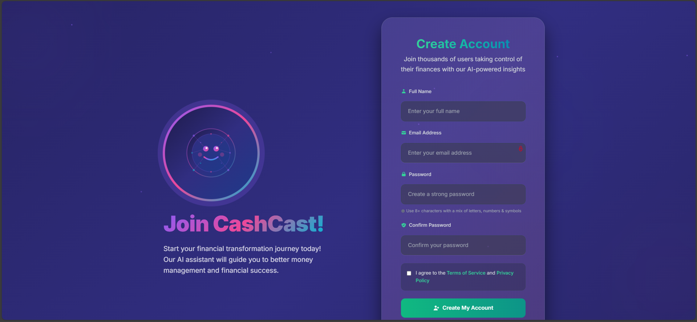
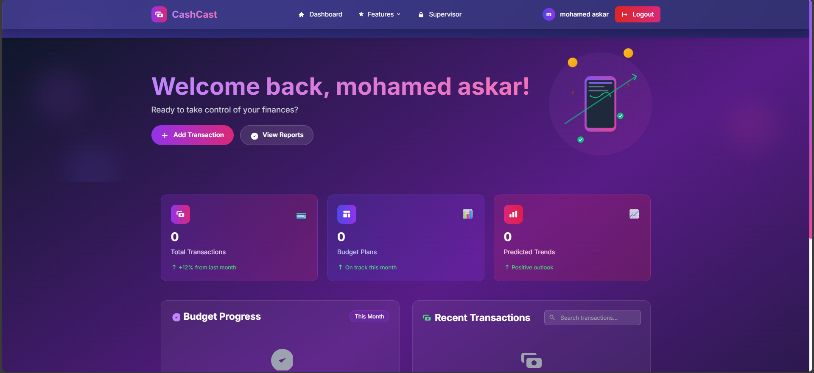

# 💰 CashCast - Financial Management Platform

**Powered by Aurora UI System v1.0**

<p align="center">
  
</p>

<p align="center">
<a href="https://github.com/laravel/framework/actions"></a>
<a href="https://packagist.org/packages/laravel/framework"></a>
<a href="https://packagist.org/packages/laravel/framework"></a>
<a href="https://packagist.org/packages/laravel/framework"></a>
</p>

## 🌟 About CashCast

CashCast is a modern financial management platform built with Laravel 11+ and powered by the **Aurora UI System** - a cutting-edge design framework that delivers exceptional user experiences through:

- ✨ **Stunning Visual Design**: Aurora-inspired gradients and animations
- 🎭 **Smooth Interactions**: Buttery-smooth transitions and hover effects
- 📱 **Responsive Layout**: Optimized for all devices and screen sizes
- 🚀 **Performance**: Hardware-accelerated animations and optimized rendering
- 🎨 **Modern UI Components**: Glass morphism, floating particles, and gradient effects

## 📸 Screenshots

### 🔐 User Registration

*Beautiful registration form with AI assistant and emerald gradient theme*



### 🏠 Dashboard

*Intuitive dashboard with financial overview and modern UI*



## 🎯 Key Features

### 💸 **Financial Management**

- Real-time expense tracking and categorization
- Budget planning and monitoring
- Transaction history with advanced filtering
- Visual reports and analytics
- Multi-currency support

### 🔐 **Security & Permissions**

- Role-based access control (RBAC) using Spatie Permission
- Supervisor dashboard for administrative tasks
- Secure user authentication and authorization
- Permission management system

### 🎨 **Aurora UI System**

- Modern, animated interface with aurora-inspired design
- Interactive charts and data visualizations
- Smooth scroll animations and transitions
- Mobile-optimized responsive design
- Dark theme with glass morphism effects

## 🛠️ Technology Stack

### 🔧 **Backend**

- **Laravel 11+**: Modern PHP framework with latest features
- **Spatie Permission**: Role and permission management
- **SQLite**: Lightweight, fast database for development
- **PHP 8.2+**: Latest PHP features and performance improvements

### 🎨 **Frontend (Aurora UI System)**
- **Tailwind CSS**: Utility-first CSS framework
- **Chart.js**: Beautiful, responsive charts
- **AOS (Animate On Scroll)**: Smooth scroll animations
- **Lottie**: Advanced animation support
- **CountUp.js**: Animated number counters
- **Inter Font**: Modern typography

### 🚀 **Development Tools**
- **Vite**: Fast build tool and development server
- **NPM/Composer**: Package management
- **Laravel Mix**: Asset compilation
- **PHPUnit**: Testing framework

## 🌟 Aurora UI System

The **Aurora UI System** is our custom-built design framework that powers the entire CashCast interface. It features:

- 🎭 **Animated Backgrounds**: Dynamic aurora-inspired gradients
- 💫 **Particle System**: Floating particles for depth and movement
- 🌈 **Glass Morphism**: Translucent cards with backdrop blur
- 🎯 **Interactive Elements**: Smooth hover effects and transitions
- 📱 **Responsive Design**: Mobile-first approach
- ♿ **Accessibility**: WCAG compliant design

👉 **[View Aurora UI System Documentation](AURORA_UI_SYSTEM.md)**

## 🚀 Getting Started

### 📋 **Prerequisites**
- PHP 8.2 or higher
- Composer
- Node.js and NPM
- SQLite (or your preferred database)

### 🔧 **Installation**

1. **Clone the repository**
   ```bash
   git clone <repository-url>
   cd CashCast
   ```

2. **Install PHP dependencies**
   ```bash
   composer install
   ```

3. **Install JavaScript dependencies**
   ```bash
   npm install
   ```

4. **Setup environment**
   ```bash
   cp .env.example .env
   php artisan key:generate
   ```

5. **Database setup**
   ```bash
   php artisan migrate
   php artisan db:seed
   ```

6. **Build assets**
   ```bash
   npm run dev
   ```

7. **Start development server**
   ```bash
   php artisan serve
   ```

### 🎯 **Default Credentials**
- **Admin User**: Check database seeder for default credentials
- **Supervisor Access**: Admin users have supervisor privileges

## 📱 Features Overview

### 🏠 **Dashboard**
- Beautiful animated hero section
- Real-time financial statistics
- Interactive charts and graphs
- Quick action buttons
- Recent transactions overview

### 👥 **User Management**
- Role-based access control
- Permission assignment
- User activity tracking
- Profile management

### 💰 **Financial Tracking**
- Expense categorization
- Budget planning
- Transaction history
- Financial reports
- Analytics dashboard

### 🔧 **Supervisor Panel**
- User permission management
- System configuration
- Security monitoring
- Administrative controls

## 🎨 UI/UX Highlights

### 🌟 **Visual Excellence**
- Aurora-inspired color scheme
- Smooth gradient animations
- Floating particle effects
- Glass morphism design
- Responsive layout

### 🎭 **Interactive Elements**
- Hover effects on cards and buttons
- Smooth page transitions
- Animated loading states
- Toast notifications
- Modal dialogs

### 📱 **Mobile Experience**
- Touch-friendly interface
- Optimized navigation
- Responsive charts
- Gesture support
- Fast loading

## 🎨 UI/UX Improvements

### Recent Design Updates

- **🔐 Enhanced Authentication Pages**: Complete redesign of login and register pages with improved alignment, visual balance, and distinct color schemes
- **🤖 AI Assistant Integration**: Unique SVG illustrations for login (blue theme) and register (emerald theme) pages with personalized greetings
- **🌈 Color Harmony**: Carefully crafted color palettes for better visual distinction between pages
- **📱 Responsive Layout**: Improved spacing, typography, and form structure for all devices
- **✨ Interactive Elements**: Enhanced hover effects, smooth transitions, and micro-interactions
- **🎯 Better Navigation**: Optimized button placement and user flow between authentication pages

### Design Philosophy

The Aurora UI System follows modern design principles:

- **Visual Hierarchy**: Clear information structure with proper spacing and typography
- **Consistent Theming**: Each page has its own color identity while maintaining brand consistency
- **Accessibility First**: WCAG-compliant design with proper contrast ratios and keyboard navigation
- **Performance Optimized**: Lightweight animations and efficient rendering
- **Mobile-First**: Responsive design that works seamlessly across all devices

## 🧪 Testing

### 🔍 **Run Tests**
```bash
# Run all tests
php artisan test

# Run specific test suite
php artisan test --testsuite=Feature

# Run with coverage
php artisan test --coverage
```

### 🚀 **Development Commands**
```bash
# Watch for file changes
npm run watch

# Build for production
npm run build

# Run database migrations
php artisan migrate

# Clear application cache
php artisan cache:clear
```

## 📚 Documentation

- **[Aurora UI System Documentation](AURORA_UI_SYSTEM.md)**: Complete design system guide
- **[Laravel Documentation](https://laravel.com/docs)**: Framework documentation
- **[Spatie Permission](https://spatie.be/docs/laravel-permission)**: Permission management

## 🤝 Contributing

We welcome contributions! Please follow these guidelines:

1. **Code Style**: Follow PSR-12 coding standards
2. **UI/UX**: Maintain Aurora UI System consistency
3. **Testing**: Add tests for new features
4. **Documentation**: Update documentation for changes
5. **Performance**: Optimize for speed and accessibility

## 🔒 Security

Security is a top priority. Features include:

- **Authentication**: Secure user login and registration
- **Authorization**: Role-based access control
- **Input Validation**: Comprehensive form validation
- **CSRF Protection**: Built-in CSRF protection
- **XSS Prevention**: Input sanitization and output encoding

If you discover a security vulnerability, please email us immediately.

## 📄 License

This project is proprietary software. All rights reserved.

## 🙏 Acknowledgments

- **Laravel Team**: For the excellent framework
- **Spatie**: For the permission package
- **Tailwind CSS**: For the utility-first CSS framework
- **Chart.js**: For beautiful data visualizations
- **AOS**: For smooth scroll animations

---

**✨ Built with Aurora UI System - Where Design Meets Innovation ✨**

## Code of Conduct

In order to ensure that the Laravel community is welcoming to all, please review and abide by the [Code of Conduct](https://laravel.com/docs/contributions#code-of-conduct).

## Security Vulnerabilities

If you discover a security vulnerability within Laravel, please send an e-mail to Taylor Otwell via [taylor@laravel.com](mailto:taylor@laravel.com). All security vulnerabilities will be promptly addressed.

## License

The Laravel framework is open-sourced software licensed under the [MIT license](https://opensource.org/licenses/MIT).
